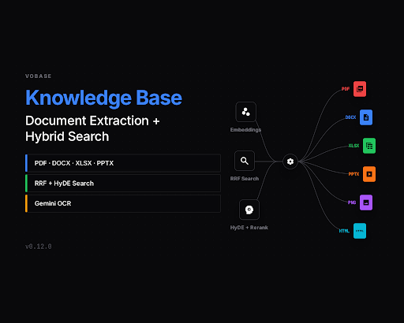

# Knowledge Base: Document Extraction + Hybrid Search

## Document Extraction Layer

The knowledge base module now supports uploading and extracting text from **6 document formats** — PDF, DOCX, XLSX, PPTX, images, and HTML. Previously, only plain text files were supported and PDF uploads silently failed because the file content was never sent to the server.

### How it works

Each format uses a best-of-breed local library for extraction, with Google Gemini 2.5 Flash as the OCR fallback for scanned documents and images:

| Format | Library | What it does |
|--------|---------|-------------|
| PDF (text) | `unpdf` | Extracts text from digital PDFs locally, zero API calls |
| PDF (scanned) | Gemini 2.5 Flash | Auto-detects scanned pages (<100 chars/page), sends to Gemini vision |
| DOCX | `mammoth` + `turndown` | Converts Word docs to HTML, then to Markdown with headers/tables |
| XLSX | `SheetJS` | Parses Excel sheets into Markdown tables with sheet headers |
| PPTX | `officeparser` | Extracts slide text from PowerPoint presentations |
| Images | Gemini 2.5 Flash | OCR via vision API — screenshots, photos, scanned documents |
| HTML | `turndown` + GFM plugin | Converts HTML to Markdown preserving tables, lists, headings |

### Async queue processing

Document processing is now fully asynchronous via the job queue:

1. **Upload handler** parses the multipart form, inserts a `pending` document record, writes the file to a temp location, and enqueues a processing job — response returns in <100ms
2. **Queue job** reads the temp file, extracts text, runs chunking + embedding, inserts into vec0 + FTS5, and marks the document as `ready`
3. **Temp cleanup** happens in a `finally` block — files are always deleted after processing

### Graceful OCR degradation

If `GOOGLE_GENERATIVE_AI_API_KEY` is not set:
- Text-based PDFs still work (local extraction via unpdf)
- Scanned PDFs and images get a `needs_ocr` status with an amber badge and a warning message
- No errors thrown — the system degrades gracefully

## Hybrid Search Improvements

Search has been upgraded with three techniques inspired by [qmd](https://github.com/tobi/qmd) and [LightRAG](https://github.com/HKUDS/LightRAG):

### Reciprocal Rank Fusion (RRF)

Replaced the fragile weighted-average score merging (`0.7 * vector + 0.3 * keyword`) with **Reciprocal Rank Fusion** (k=60). RRF is rank-based, not score-based — it doesn't depend on normalizing incompatible score distributions between vec0 distances and FTS5 ranks. The formula is simple: `RRF(d) = sum(1 / (k + rank_i(d)))` across all result lists.

### Search modes: fast and deep

A new `mode` option controls search behavior:

- **`fast`** (default) — RRF merges vector similarity + FTS5 keyword results. No LLM calls in the search path. Sub-300ms latency.
- **`deep`** — Adds HyDE query expansion and optional LLM re-ranking. 3-4x more API calls but significantly better relevance. Used by the chatbot KB tool.

### HyDE (Hypothetical Document Embedding)

In deep mode, the search generates a hypothetical answer to the query via `generateText()`, embeds that answer, and runs an additional vector search. The hypothetical answer is often closer in embedding space to relevant chunks than the original question — this dramatically improves recall for complex queries.

Three rank lists (semantic, HyDE, FTS5) are merged via RRF.

### LLM Re-ranking

Optional post-RRF step: sends the top candidates to an LLM with "rank these passages by relevance" and re-orders the results. Enabled via `rerank: true` in search options.

All LLM calls in the search path have try/catch with graceful degradation — if HyDE or re-ranking fails, search falls back to the simpler path automatically.

## Chatbot KB Integration

The chatbot's knowledge base tool now uses **deep mode** search by default, giving it access to HyDE query expansion and RRF fusion for better document retrieval during conversations.

## Frontend Changes

- **File picker** now accepts `.pdf`, `.docx`, `.xlsx`, `.pptx`, `.png`, `.jpg`, `.jpeg`, `.webp`, `.html`, `.txt`, `.md`, `.csv`
- **Upload** sends actual file bytes via `FormData` (previously only sent filename as JSON)
- **`needs_ocr` status** shows an amber badge when OCR is needed but no API key is configured
- **`vectorWeight`/`keywordWeight`** options are deprecated (kept for backward compatibility, ignored internally)

## Dependencies Added

- `mammoth` — DOCX to HTML conversion
- `turndown` + `turndown-plugin-gfm` — HTML to Markdown with GFM tables
- `xlsx` — Excel parsing (SheetJS)
- `officeparser` — PPTX text extraction
- `@ai-sdk/google` — Gemini provider for Vercel AI SDK

## Bug Fixes

- Fixed `created_at` NOT NULL constraint in pipeline raw SQL insert
- Fixed `officeparser` v6 API change (returns AST with `.toText()`, not string)
- Fixed HTML MIME type matching for `text/html;charset=utf-8`
- Fixed `sqlite-vec` extension path resolution in Bun monorepo
- Fixed `GEMINI_API_KEY` env var compatibility (now checks both `GOOGLE_GENERATIVE_AI_API_KEY` and `GEMINI_API_KEY`)

## Test Coverage

- 13 extraction tests with real document fixtures (PDF, DOCX, XLSX, PPTX, HTML, images)
- 15 search tests covering RRF scoring, fast/deep modes, HyDE, re-ranking, graceful degradation
- 16 handler tests including multipart upload, job enqueue, and error cases
- 12 chunker tests (unchanged)
