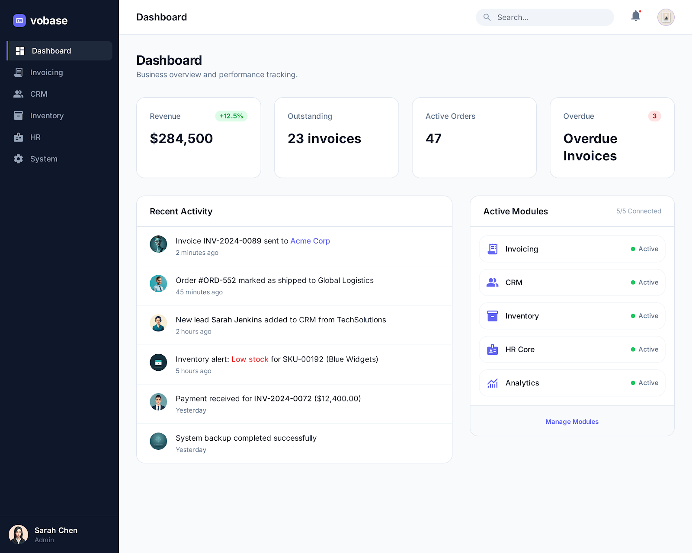
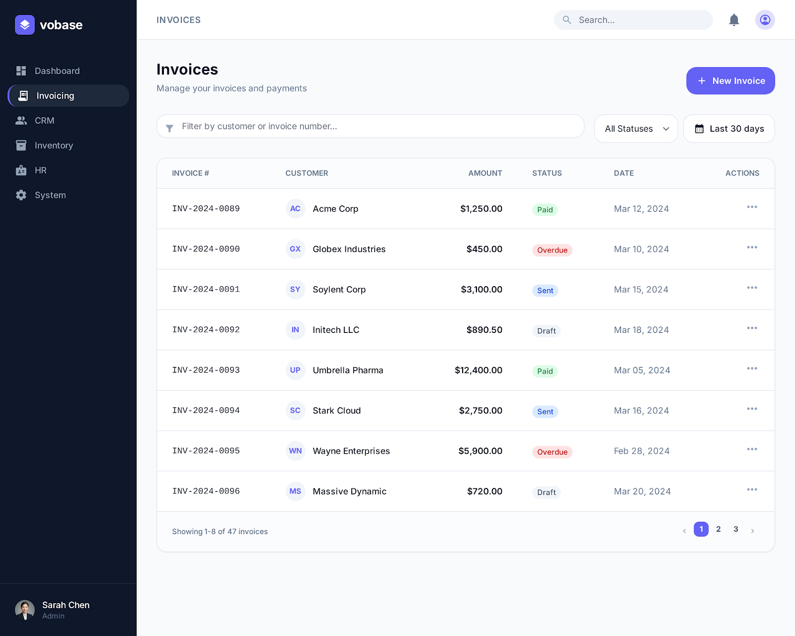
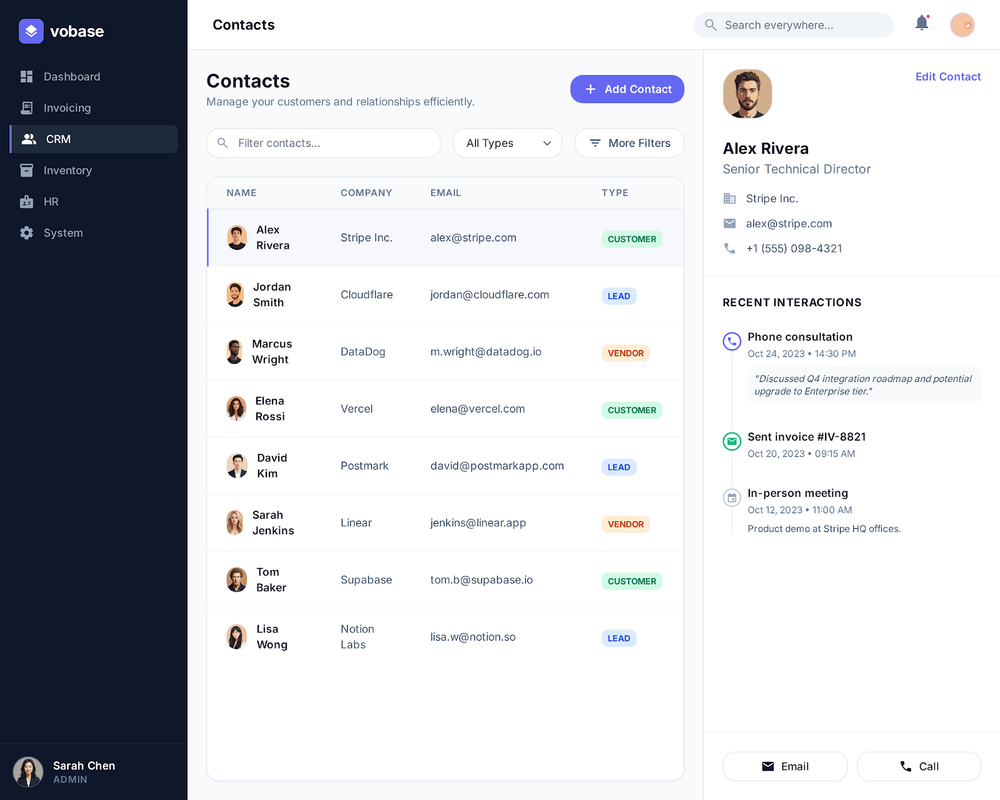
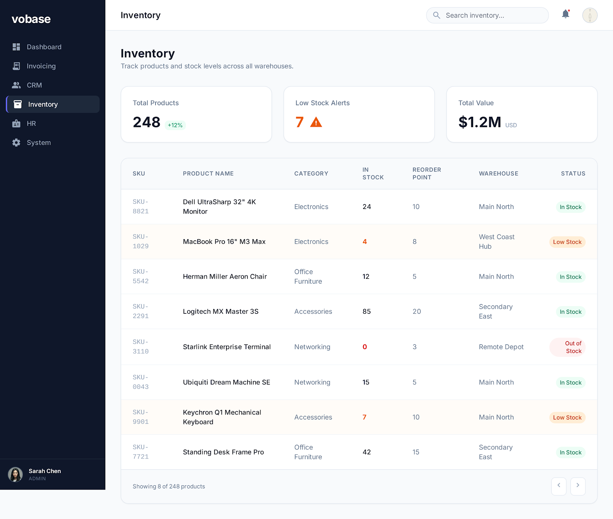
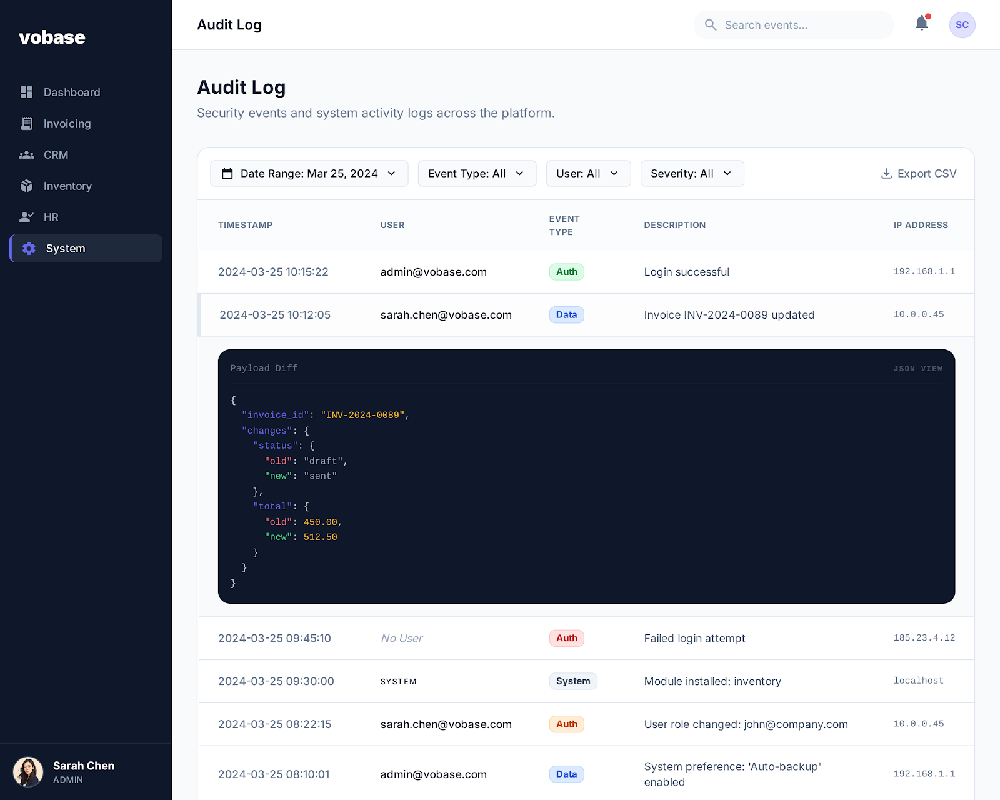
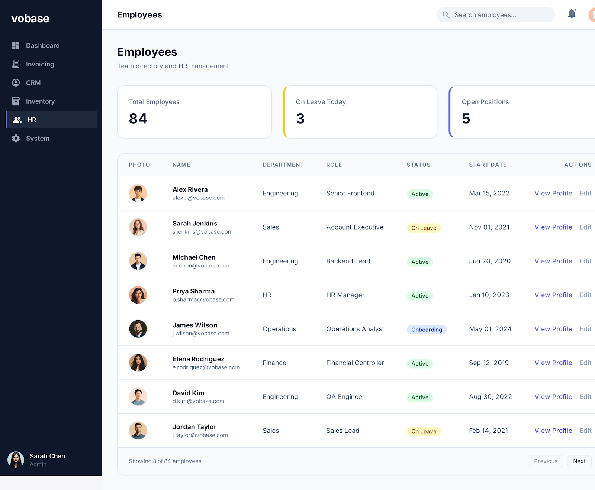
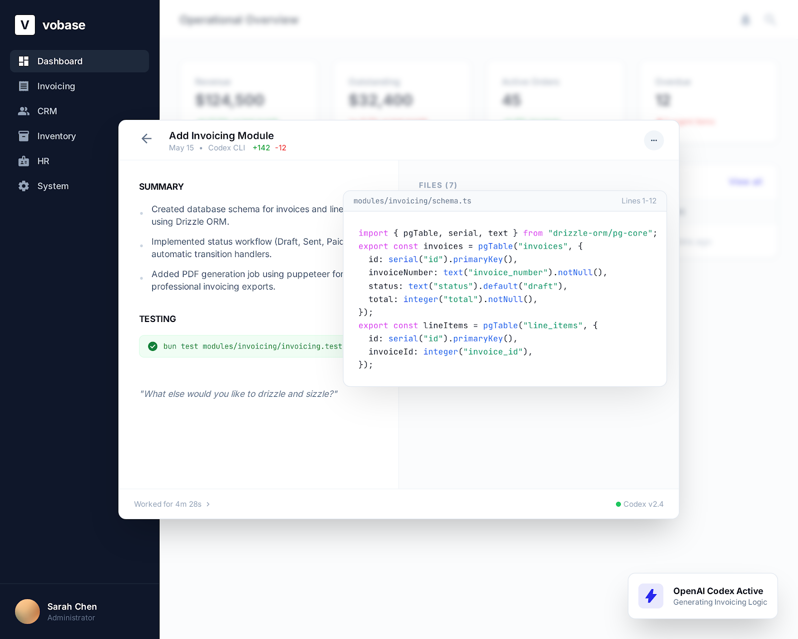

<p align="center">
  <b>vobase</b><br>
  AI-native ERP engine. One codebase. One SQLite file. One Docker container.
</p>

<p align="center">
  
  
  
  
  
  
  
  
</p>

<p align="center">
  <a href="#who-is-this-for">who it's for</a> ·
  <a href="#quick-start">get started</a> ·
  <a href="#what-a-module-looks-like">code</a> ·
  <a href="#agent-skills-recipes">skills</a> ·
  <a href="#then-vs-now">why this works</a> ·
  <a href="https://docs.vobase.dev">docs</a> ·
  <a href="https://discord.gg/vobase">discord</a>
</p>

---

<table>
  <tr>
    <td><a href=".github/screenshots/dashboard.png"></a></td>
    <td><a href=".github/screenshots/invoicing.png"></a></td>
    <td><a href=".github/screenshots/crm.png"></a></td>
  </tr>
  <tr>
    <td align="center">Operations Dashboard</td>
    <td align="center">Invoicing</td>
    <td align="center">CRM Contacts</td>
  </tr>
  <tr>
    <td><a href=".github/screenshots/inventory.png"></a></td>
    <td><a href=".github/screenshots/audit-log.png"></a></td>
    <td><a href=".github/screenshots/hr.png"></a></td>
  </tr>
  <tr>
    <td align="center">Inventory</td>
    <td align="center">Audit Log</td>
    <td align="center">HR Directory</td>
  </tr>
  <tr>
    <td colspan="3" align="center">
      <a href=".github/screenshots/ai-workflow.png"></a>
    </td>
  </tr>
  <tr>
    <td colspan="3" align="center">Building an invoicing module with Codex</td>
  </tr>
</table>

---

You've been told ERP is complicated. That mid-market implementations take 12-18 months and cost between $500K and $2M. That you need SAP consultants at $300/hr to click through configuration screens, or Odoo partners to untangle inheritance conflicts, or ERPNext developers to learn a custom doctype system that breaks at 150 fields.

70% of those implementations fail to meet business goals. Average budget overruns run 178%. The consultants who built the last generation of these systems are retiring — 40% of SAP consultants are over 50, and only 39% of SAP ECC customers have even started migrating to S/4HANA despite a 2027 deadline.

That world assumed code was expensive to write. It isn't anymore.

**Vobase is a TypeScript ERP engine where AI writes the business logic.** You describe what your client needs — an invoicing module, an inventory tracker, a custom approval workflow. Claude Code, Cursor, Codex, or OpenClaw reads your schema, loads your ERP agent skills, and generates handlers, schemas, and React pages that follow strict conventions. Everything runs in a single Docker container with a single SQLite file.

You own the code. You own the data. You own the infrastructure.

No built-in AI agent. No browser IDE. No proprietary platform. Just a well-structured TypeScript runtime that any AI tool can read, understand, and extend.

---

### who is this for

**ERP consultants** who spend most of their time fighting the platform instead of understanding the client's business. Vobase inverts that ratio. The platform stays out of the way. Your job becomes describing requirements clearly and reviewing the code AI generates. Consultant rates in mid-market ERP run $150-300/hr, with top partners at $800-1,200/hr. 80% of revenue is repeat clients. This market isn't going away — it's getting more accessible.

**Developers replacing legacy systems.** Oracle EBS, SAP Business One, custom Access databases, the spreadsheet that runs half the company. You don't need to learn ABAP or join a 12-month implementation team. You need to understand the business process and let AI handle the code. Vobase gives you the ERP conventions so you're not reinventing them from scratch.

**Technical founders building vertical SaaS** for industries still running on faxes and spreadsheets — medical billing, property management, logistics, agriculture, field services. Vobase provides the ERP primitives (auth, audit, jobs, MCP, storage) so you can focus entirely on the domain.

The talent crisis makes this urgent. 70% of ERP implementations [fail to meet business goals](https://www.linkedin.com/posts/odecloud_erp-implementation-failure-gartner). 61% of SAP customers [haven't started their S/4HANA migration](https://www.theregister.co.uk/) with a 2027 deadline. The people who know how to do this work are aging out of the workforce.

Three groups are converging on this opportunity: AI startup founders whose wrapper products lost their moat, indie developers whose SaaS got commoditized, and junior engineers facing a shrinking entry-level job market. All of them have technical skills. None of them know ERP. The skill gap is what Vobase closes.

---

### quick start

```bash
bunx vobase init my-erp
cd my-erp
bun install
bunx vobase dev
```

Backend on `:3000`, frontend on `:5173`. Ships with a dashboard, audit log viewer, and operations list out of the box.

---

### what you can build

Every module is a self-contained directory: schema, handlers, jobs, pages. No plugins, no marketplace, no app store. Just TypeScript you own.

| Use Case | What Ships |
|---|---|
| **Invoicing & AP/AR** | Invoices, line items, payments, aging reports, reminders. Status workflows: draft → sent → paid → void. Gap-free invoice numbering via database transactions. |
| **Inventory & Warehousing** | Products, stock movements, reorder alerts, warehouse transfers. Integer quantities, audit trails on every movement. |
| **CRM & Contacts** | Companies, contacts, interaction timelines, deal tracking. Cross-module references to invoicing and orders without hard foreign keys. |
| **HR & People** | Employee directory, departments, leave management, onboarding checklists. Role-based visibility per department. |
| **Order Management** | Purchase orders, sales orders, approval chains, fulfillment tracking. FlowProducer job chains for multi-step workflows. |
| **Your Client's Vertical** | Medical billing, property management, fleet tracking, agricultural co-ops — whatever the business needs. Describe it to your AI tool. It generates the module. |

Module starters ship with the CLI: `vobase add invoicing`, `vobase add inventory`, `vobase add crm`. Like `npx shadcn add button` — files get copied, you own the code.

---

### how it works

Vobase doesn't have a built-in AI. It does something more useful: it makes itself legible to every AI tool on the market.

The engine ships with an **MCP server** that exposes your schema, installed modules, and runtime context to Claude Code, Cursor, or anything that speaks MCP. Domain and module-specific knowledge lives in **agent skills**. `AGENTS.md` is project context and guardrails.

When you need a new capability:

1. Open your AI tool and describe the requirement
2. The AI reads your existing schema, your module conventions, and the relevant agent skills
3. It generates a complete module — schema, handlers, jobs, pages, tests, seed data
4. You review the diff, run `bunx vobase dev`, and it works

Your skills cover the parts where ERP gets tricky: money stored as integer cents (never floats — IEEE 754 rounding will cost you real money at scale), status transitions as explicit state machines (not arbitrary string updates), gap-free business numbers generated inside database transactions (not auto-increment IDs that leave holes when transactions roll back).

These conventions are what make AI-generated modules work on the first try instead of the third.

**The thesis:** your specs and domain knowledge are the asset. AI tools are the compiler. The compiler gets better every quarter. Your recipes and skills compound forever.

---

### what a module looks like

Every module declares itself through `defineModule()`. This convention is what AI tools rely on to generate correct code on the first try.

```typescript
// modules/invoicing/index.ts
import { defineModule } from '@vobase/core'
import * as schema from './schema'
import { routes } from './handlers'
import { jobs } from './jobs'
import * as pages from './pages'
import seed from './seed'

export default defineModule({
  name: 'invoicing',
  schema,
  routes,
  jobs,
  pages,
  seed,
})
```

```
modules/invoicing/
  schema.ts           ← Drizzle table definitions
  handlers.ts         ← Hono routes (HTTP API)
  handlers.test.ts    ← colocated tests (bun test)
  jobs.ts             ← background tasks (SQLite-backed, no Redis)
  pages/              ← React pages (list, detail, create)
  seed.ts             ← sample data for dev
  index.ts            ← defineModule()
```

<details>
<summary><b>schema example</b> — Drizzle + SQLite with integer money, timestamps, status enums</summary>

```typescript
// modules/invoicing/schema.ts
import { sqliteTable, text, integer } from 'drizzle-orm/sqlite-core'
import { nanoidPrimaryKey } from '@vobase/core'

export const invoices = sqliteTable('invoices', {
  id: nanoidPrimaryKey(),
  number: text('number').unique().notNull(),           // INV-2024-0001
  customer_name: text('customer_name').notNull(),
  amount_cents: integer('amount_cents').notNull(),      // $142.50 = 14250
  status: text('status').notNull().default('draft'),    // draft -> sent -> paid -> void
  created_at: integer('created_at', { mode: 'timestamp_ms' })
    .notNull().$defaultFn(() => new Date()),
  created_by: text('created_by').notNull(),
})

export const lineItems = sqliteTable('line_items', {
  id: nanoidPrimaryKey(),
  invoice_id: text('invoice_id').references(() => invoices.id),  // hard FK, same module
  description: text('description').notNull(),
  quantity: integer('quantity').notNull(),
  unit_price_cents: integer('unit_price_cents').notNull(),
})
```

Money is integer cents — safe to $90 billion, no floating point rounding. Cross-module references use plain columns without `.references()` because the other module might not be installed.

</details>

<details>
<summary><b>handler example</b> — Hono routes with typed context and authorization</summary>

```typescript
// modules/invoicing/handlers.ts
import { Hono } from 'hono'
import { getCtx } from '@vobase/core'
import { invoices } from './schema'

export const routes = new Hono()

routes.get('/invoices', async (c) => {
  const ctx = getCtx(c)
  return c.json(await ctx.db.select().from(invoices))
})

routes.post('/invoices', async (c) => {
  const ctx = getCtx(c)
  const body = await c.req.json()

  if (ctx.user.role !== 'accountant') {
    return c.text('Forbidden', 403)
  }

  const invoice = await ctx.db.insert(invoices).values({
    ...body,
    amount_cents: Math.round(body.amount * 100),
    created_by: ctx.user.id,
  })

  return c.json(invoice)
})
```

The frontend gets typed API calls for free via Hono RPC:

```typescript
import { hc } from 'hono/client'
import type { AppType } from '../server'

const client = hc<AppType>('/')
const res = await client.api.invoices.$get()
const invoices = await res.json()  // fully typed, no codegen
```

</details>

<details>
<summary><b>job example</b> — background tasks, SQLite-backed, no Redis</summary>

```typescript
// modules/invoicing/jobs.ts
import { defineJob } from '@vobase/core'
import { invoices } from './schema'
import { eq } from 'drizzle-orm'

export const sendReminder = defineJob('invoicing:sendReminder',
  async (data: { invoiceId: string }) => {
    const invoice = await db.select().from(invoices)
      .where(eq(invoices.id, data.invoiceId))
    // send email, update status, log the action
  }
)
```

`db` can be imported from your module runtime or wired via closure/factory when you define jobs.

Schedule from handlers: `ctx.scheduler.add('invoicing:sendReminder', { invoiceId }, { delay: '30d' })`

Retries, cron scheduling, and job dependencies via FlowProducer (chains, DAGs, parallel fan-out/fan-in) — all SQLite-backed, 286K ops/sec.

</details>

---

### the ctx object

Every HTTP handler gets four things. Nothing else.

| Property | What it does |
|---|---|
| `ctx.db` | Drizzle instance. Full SQL via bun:sqlite — reads, writes, transactions, migrations. |
| `ctx.user` | `{ id, email, name, role }`. From better-auth session. Used for authorization checks. |
| `ctx.scheduler` | Job queue. `add(jobName, data, options)` to schedule background work. |
| `ctx.storage` | File ops with audit logging. Upload, download, delete. SOC 2 encryption hooks go here when you need them. |

For jobs, pass dependencies through closures/factories (or import what you need) when calling `defineJob(...)`.

---

### agent skills recipes

Agent skills are the domain knowledge layer. AI tools load skills before generating code. Recipe quality is product quality — these conventions are what separate a working module from a broken one. `AGENTS.md` stays focused on project context, constraints, and conventions.

Skills fall into three categories:

#### horizontal skills — data conventions that apply across every module

These are the ERP-wide rules that prevent the most common mistakes. Every module follows them.

| Recipe | Convention |
|---|---|
| Money | Integer cents. Column: `amount_cents`. Display: `(cents / 100).toFixed(2)`. Safe to $90 billion. Never floats. |
| Timestamps | UTC integer milliseconds. Every table gets `created_at` + `updated_at`. Timezone conversion in frontend only. |
| Status workflows | Explicit transitions: `draft → sent → paid → void`. Validated in handler code. No workflow engine needed. |
| Business numbers | `nextSequence(tx, 'INV')` — gap-free, transaction-safe. Never use auto-increment IDs as business numbers. |
| Audit trails | `trackChanges(tx, table, id, old, new)` for business-critical records. JSON diffs in `_record_audits`. |
| Cross-module refs | Plain column, no `.references()`. Hard foreign keys within a module only. |
| Pagination | Cursor-based: `WHERE id > :lastId ORDER BY id LIMIT :pageSize`. Never `OFFSET` over 10K rows. |
| Full-text search | FTS5 (compiled into bun:sqlite). Virtual tables, `MATCH` queries with `rank`. |
| Soft deletes | Don't. ERPNext, Odoo, and NetSuite all skip soft deletes. Use status fields or prevent deletion of transacted records. |

#### vertical skills — module-specific and industry-specific logic

These encode the domain knowledge for a particular business function or industry vertical. Each skill teaches the AI how that domain actually works — the edge cases, the compliance rules, the workflows that took consultants years to learn.

| Skill | What it encodes |
|---|---|
| Invoicing approval workflows | Multi-tier approval chains, delegation rules, escalation timers, threshold-based routing. |
| Inventory lot tracking | FIFO/LIFO costing, batch/lot numbers, expiry dates, serial number management. |
| Multi-currency handling | Exchange rate tables, conversion at transaction time vs reporting time, unrealized gain/loss calculations. |
| Payroll processing | Pay period calculations, tax bracket logic, deduction ordering, statutory compliance per jurisdiction. |
| Medical billing (vertical) | CPT/ICD-10 code validation, insurance claim lifecycle, ERA/EOB parsing, denial management workflows. |
| Property management (vertical) | Lease lifecycle, rent roll calculations, CAM reconciliation, tenant ledgers, maintenance work orders. |
| Agricultural co-op (vertical) | Harvest intake, grading/quality tiers, pool pricing, patronage dividend calculations, seasonal cash flow. |

You publish these as `.agents/skills/{skill-name}/SKILL.md`. The AI loads them when generating or modifying the relevant module. A consultant who solves a complex invoicing edge case once writes it as a skill — every future project gets that knowledge for free.

#### migration skills — moving from existing systems

These guide the AI through extracting data and business logic from legacy platforms. Migration is where most ERP projects burn time and budget. Skills encode the extraction patterns, data mapping rules, and validation steps so the AI can generate migration scripts instead of you writing them by hand.

| Skill | What it covers |
|---|---|
| SAP Business One export | Connecting to HANA/SQL Server, mapping SAP document types to Vobase modules, handling SAP's numeric precision, preserving document numbering sequences. |
| ERPNext/Frappe migration | Extracting from MariaDB doctypes, flattening Frappe's JSON custom fields, converting naming series, mapping workflow states. |
| Odoo data extraction | Navigating Odoo's `ir.model.data` XML IDs, resolving `many2one`/`many2many` references, converting Odoo's decimal precision to integer cents. |
| Spreadsheet import | Parsing the Excel file that runs half the company. Column mapping, data validation, duplicate detection, incremental sync for the transition period where both systems run in parallel. |
| QuickBooks / Xero migration | Chart of accounts mapping, transaction history import, open invoice/bill migration, bank reconciliation state preservation. |

Migration skills include validation recipes: row counts match, financial totals reconcile, open document statuses are preserved. The AI generates both the migration script and the verification queries.

---

### then vs now

The ERP industry spent 30 years building infrastructure for a problem that no longer exists: code was expensive to write, so vendors built systems that let you configure instead of code.

That tradeoff made sense in 2005. It doesn't make sense when an AI tool writes a complete CRUD module — schema, API, frontend, tests — in 90 seconds.

Here is what traditional platforms built and why none of it ages well:

| what they built | why it existed | what actually happened |
|---|---|---|
| **Doctype / entity engines** | Defining database tables without writing SQL was hard. ERPNext built a GUI for it. | AI generates typed Drizzle schemas from a sentence. Meanwhile, ERPNext's doctype system [hits MySQL row limits at 150 fields](https://github.com/frappe/frappe/issues/22381) and [breaks core features with custom fields](https://github.com/frappe/erpnext/issues/51724). You're debugging a meta-programming layer instead of editing a 20-line schema file. |
| **CRUD generators** | Writing list/detail/create pages was repetitive boilerplate nobody wanted to do by hand. | AI generates specific React pages with TanStack Table, proper validation, and correct business logic — customized to the use case, not a generic scaffold. Django's own documentation says the admin is ["not intended for building your entire front end around."](https://arvydas.dev/20240529T164812--valid-points-for-not-using-django-admin-as-a-primary-ui-for-your-project__django.html) Stock admin UIs become a [liability at scale](https://jmduke.com/posts/outgrowing-django-admin.html). |
| **Field configurators** | Adding a column meant writing a migration. Platforms built runtime GUIs for it. | `drizzle-kit generate` handles migrations. AI adds the column, generates the migration, updates the form, and writes the test — in one shot. Runtime field configurators add a metadata layer that [degrades performance with every custom field](https://github.com/frappe/erpnext/issues/31673) and creates [N+1 query problems](https://github.com/frappe/erpnext/issues/51610) that third-party tools have to [patch around](https://github.com/rtCamp/frappe-optimizations). |
| **Low-code databases** | Not everyone knew SQL. Visual query builders and Airtable-style interfaces filled the gap. | SQLite + Drizzle gives you full SQL with TypeScript type safety. AI writes the queries. Companies [routinely abandon low-code platforms](https://www.meerako.com/blogs/case-study-migrating-bubble-no-code-to-nextjs-custom-code) once they hit the ceiling — and then they're migrating data out of a proprietary format. |
| **Plugin / inheritance systems** | Customization required hook registries, class inheritance, and extension points. | When you own the code, you just edit the file. No inheritance conflicts, no hook ordering bugs, no ["mixing apples and oranges"](https://stackoverflow.com/questions/56414532/odoo-typeerror-mixing-apples-and-oranges-on-inherited-model) errors. Odoo upgrades [break custom modules](https://www.reddit.com/r/Odoo/comments/1izmd44/upgrade_to_v18_yet/) so reliably that companies [spend $48,000 before anything works](https://www.reddit.com/r/Odoo/comments/1iztmgs/odoo_should_not_be_in_business/). |
| **Multi-tenancy** | Hosting was expensive. You had to cram everyone into one database with tenant_id filtering on every query. | One container per customer. Physical data isolation. Zero cross-tenant leak risk. 200 customers costs $3,500/month. Compare that to debugging row-level security policies at 3am. |
| **Configuration GUIs** | Changing behavior meant clicking through hundreds of settings screens maintained by consultants. | Behavior lives in code. AI changes it. You review the diff. It's version-controlled. You can revert it. SAP's "customizing tables" are legendary for turning 3-week requirements into 6-month implementations. |

Some broader patterns worth noting:

**The upgrade treadmill is real.** ERPNext upgrades [reset customized form layouts](https://github.com/frappe/erpnext/issues/4958) and [leave behind orphaned custom fields that break future installs](https://github.com/frappe/frappe/issues/24108). Odoo version bumps [don't migrate budget definitions](https://www.reddit.com/r/Odoo/comments/1izmd44/upgrade_to_v18_yet/), and switching from Community to Enterprise means [rewriting modules because the previous developer changed base code](https://www.reddit.com/r/Odoo/comments/17gvuqd/help_and_tips_to_upgrade_from_odoo_15_to_16/). When you own your code, you upgrade when you want, test what you want, and deploy when it's ready.

**Consultants spend most of their time fighting the platform.** The typical ERP consultant splits their time roughly 70/30 — seventy percent on platform mechanics (configuration screens, debugging hooks, customizing doctypes, untangling inheritance) and thirty percent on actual business logic. Vobase inverts that. Your job is understanding the client's business, describing it clearly, and reviewing the code AI generates. The platform gets out of the way.

**ERP is not special software.** It's a web application with domain-specific business logic. The mystique around it exists because vendors and consultants profit from the complexity. An invoicing module is a database table, a few API endpoints, and some frontend pages. A status workflow is an if-statement. An audit trail is a JSON diff written to a table. The hard part was always the domain knowledge — knowing that money must be stored as integer cents, that business numbers must be gap-free, that status transitions must be explicit. That's what your agent skills encode. The rest is a standard TypeScript project.

---

### vs the alternatives

| | **Vobase** | **ERPNext** | **Odoo** | **SAP B1** | **Custom build** |
|---|---|---|---|---|---|
| Time to first module | Minutes (AI) | Hours (doctype GUI) | Hours (Python/XML) | Weeks (ABAP) | Hours-days |
| Language | TypeScript | Python + Frappe DSL | Python + XML views | ABAP / Fiori | Your choice |
| Database | SQLite (one file) | MariaDB / Postgres | PostgreSQL | HANA / SQL Server | Your choice |
| How you customize | Edit the code | Doctype GUI + hooks | Module inheritance | Config + ABAP | Write code |
| Upgrades | Your code, your schedule | [Resets layouts](https://github.com/frappe/erpnext/issues/4958) | [Breaks migrations](https://www.reddit.com/r/Odoo/comments/1izmd44/upgrade_to_v18_yet/) | Forced S/4HANA 2027 | Your schedule |
| AI integration | MCP + agent skills | None | None | Joule (closed) | Manual |
| Hosting | as low as $15 | $25-50/mo | $24-46/user/mo | $$$$ | Varies |
| Data isolation | Physical | Logical | Logical | Physical ($$$) | Varies |
| Consultant lock-in | None (TypeScript) | Frappe required | Odoo required | ABAP required | None |
| License | MIT | GPL v3 | LGPL / Proprietary | Commercial | Varies |

Odoo is ["a mile wide but an inch deep — it demos like a dream, but the moment you scratch the surface, you're customizing."](https://www.reddit.com/r/Odoo/comments/1qz0p4o/what_is_odoo_actually_bad_at_looking_for/) Custom builds give you freedom but no domain conventions — you reinvent ERP patterns from scratch on every project. Vobase gives you the conventions and the freedom.

---

### runtime architecture

One Bun process. One Docker container. One company.

```
Docker container (--restart=always)
  └── Bun process (PID 1)
        ├── Hono server
        │     ├── /auth/*   → better-auth (sessions, passwords, CSRF)
        │     ├── /api/*    → module handlers (JWT-validated)
        │     ├── /mcp      → MCP server (same process, shared port)
        │     └── /*        → frontend (static, from dist/)
        ├── Drizzle (bun:sqlite, single file in /data/)
        │     └── WAL mode, 5s busy timeout, foreign keys ON
        ├── bunqueue (SQLite-backed job queue, 286K ops/sec)
        └── Audit middleware (all mutations → _audit_log)
```

Conceptually similar to Cloudflare Workers — TypeScript handlers + database + queue + storage — but self-hosted, stateful, and without vendor lock-in.

---

### tech stack

| Layer | Choice | Why this, not that |
|---|---|---|
| Runtime | **Bun** | Native TypeScript, ~50ms startup, built-in SQLite via bun:sqlite, built-in test runner. |
| Database | **SQLite** via Drizzle | Real SQL with JOINs and aggregations. ACID transactions. One .db file. Zero external dependencies. |
| Auth | **better-auth** | 12K+ stars, SQLite-native, session/JWT, password hashing, CSRF. Org/RBAC/SSO/2FA as plugins. |
| API | **Hono** | ~14KB, typed routing, Bun-first. Every AI coding tool already knows Hono. |
| ORM | **Drizzle** | Type-safe SQL, bun-sqlite adapter, migration generation via drizzle-kit. |
| Jobs | **bunqueue** | Bun-native, SQLite-backed, BullMQ-compatible API. 286K ops/sec, retries, cron, FlowProducer. No Redis. |
| MCP | **@modelcontextprotocol/sdk** | Official SDK. Tools, resources, prompts, SSE. Same process, shared port. |
| Frontend | **React + TanStack** | Router (virtual file routes), Query, Table. Pure SPA, no SSR. Auto code-splitting. |
| Components | **shadcn/ui + Tailwind v4** | You own the component source. v4's CSS-based config means no tailwind.config.js. |
| Backups | **Litestream** | Continuous WAL streaming to S3. ~1 second RPO. Point-in-time recovery. ~$0.03/month. |

---

### why sqlite

At 10-200 concurrent users per instance, SQLite with WAL mode outperforms Postgres. PocketBase, Directus, and Strapi all run on it. This isn't a prototype choice — it's an architecture decision.

Backup your entire system:

```bash
cp vobase.db backup.db
```

Clone production for staging:

```bash
cp data/vobase.db data/staging.db
DATABASE=./data/staging.db PORT=3001 bunx vobase dev
```

One file copy. Exact production clone. No database dump/restore, no PII sanitization, no connection string changes. Try doing that with a staging Postgres instance.

Disaster recovery via Litestream — continuous WAL streaming to S3, roughly one second of lag:

```bash
litestream restore -o /data/vobase.db -timestamp 2026-03-01T10:00:00Z s3://my-backups/instance-id
```

Cost: $0.03-0.05/month. Point-in-time recovery to any second.

---

### mcp server

Runs in the same Bun process on the same port. When you connect Claude Code, Codex, Cursor, or any MCP-compatible tool, it sees everything:

| Category | What's Exposed |
|---|---|
| **Read** | `list_modules`, `read_module`, `get_schema`, `view_logs`, `get_migration_status` |
| **Write** | `deploy_module`, `install_package` |
| **Query** | `query_db`, `run_smoke_test` |
| **Context** | Schema definitions, module signatures, ctx API docs, recent errors, project context from `AGENTS.md`, domain knowledge from skills |

The AI sees your exact data model, your existing modules, and the domain conventions before it writes a single line of code. This is why generated modules tend to work on the first try.

---

### deployment

Ship a Docker image. Add Caddy for HTTPS. Done.

```yaml
# docker-compose.yml
services:
  vobase:
    image: your-registry/my-vobase:latest
    restart: always
    volumes:
      - vobase_data:/data
    ports:
      - "3000:3000"
    logging:
      driver: "json-file"
      options:
        max-size: "50m"
        max-file: "3"
  caddy:
    image: caddy:latest
    ports:
      - "80:80"
      - "443:443"
```

Litestream wraps the Bun process for continuous backup:

```dockerfile
COPY litestream.yml /etc/litestream.yml
ENTRYPOINT ["litestream", "replicate", "-exec", "bun run server.ts"]
```

Every customer gets their own container, their own database, their own backup stream. Physical isolation, not row-level security policies.

---

### soc 2 readiness

About 90 lines of compliance code. No architectural changes needed.

| Control | Implementation | Effort |
|---|---|---|
| Auth event logging | better-auth `after` hooks → `_audit_log` (login, logout, failed attempts, role changes) | ~20 lines |
| Health endpoint | `GET /health` → `{ status, db, uptime }` | ~10 lines |
| Automated backups | Litestream continuous WAL streaming to S3/GCS/Azure, ~1s RPO, point-in-time restore | Config only |
| Audit retention | Scheduled cleanup of logs older than configured period | ~20 lines |

Customer infrastructure handles encryption at rest (Docker encrypted volumes), HTTPS (reverse proxy), and firewall. Standard self-hosted pattern — PocketBase, Directus, Strapi handle it the same way.

`ctx.storage` is the compliance hook. When requirements arrive, encryption-before-write, file access logging, retention policies, and access verification all go in that one place.

---

### cli commands

| Command | What it does |
|---|---|
| `vobase init` | Scaffold a new project with system module, `AGENTS.md`, and config. |
| `vobase dev` | Start Bun backend with `--watch` and Vite frontend. Auto-restarts on changes. |
| `vobase migrate` | Run `drizzle-kit migrate`. Backs up the database first, automatically. |
| `vobase migrate:generate` | Generate migration files via `drizzle-kit generate`. |
| `vobase generate` | Rebuild route tree and system schemas from module definitions. |

Roadmap commands (not implemented yet): `vobase add {module}`, `vobase seed`, `vobase backup`.

---

### what we chose not to build

| Decision | Reasoning |
|---|---|
| **No auto-CRUD** | AI generates better, customized pages. Auto-generated admin UIs are ["not intended for building your entire front end around"](https://arvydas.dev/20240529T164812--valid-points-for-not-using-django-admin-as-a-primary-ui-for-your-project__django.html) and become a [liability at scale](https://jmduke.com/posts/outgrowing-django-admin.html). |
| **No multi-tenancy** | One container per company. Physical isolation is simpler and more secure. Zero cross-tenant data leaks. |
| **No second language** | Originally planned Go for OpenFGA and workflow orchestration. Dropped both — zero justification for two languages, two build steps, IPC between processes. |
| **No Supabase** | Self-hosted Supabase is 10+ Docker containers. RLS is poor developer experience. Over-engineered for single-tenant. |
| **No libSQL/Turso** | Branching and PITR are locked to Turso Cloud (paid). bun:sqlite is built-in and synchronous. Litestream handles PITR for $0.03/month. |

---

### project structure

```
my-vobase/
  .env
  .env.example
  package.json            ← depends on @vobase/core
  drizzle.config.ts
  vobase.config.ts        ← database path, auth, backup schedule
  vite.config.ts          ← Vite + TanStack Router + path aliases
  index.html
  server.ts               ← createApp() entry + export type AppType
  AGENTS.md               ← project context and guardrails
  .agents/
    skills/
      invoicing-approval/
        SKILL.md          ← example domain/module skill for AI coding tools
  .tanstack/
    tmp/
  .turbo/
  modules/
    system/               ← admin dashboard (scaffolded)
      schema.ts
      pages/
        layout.tsx
        list.tsx
        logs.tsx
        pages.test.tsx
    index.ts              ← module registry
    invoicing/            ← optional module you add with `vobase add`
      index.ts            ← defineModule()
      schema.ts
      handlers.ts
      jobs.ts
      pages/
  src/
    main.tsx
    home.tsx
    home.test.tsx
    root.tsx
    routes.ts             ← generated route definitions
    routeTree.gen.ts      ← generated TanStack route tree
    data/
      mockData.ts
    lib/
      api-client.ts
      auth-client.ts
      utils.ts
    components/
      ui/                 ← shadcn/ui (owned by you)
    shell/
      layout.tsx
      sidebar.tsx
      auth/
        login.tsx
        signup.tsx
    styles/
      app.css
  data/
    vobase.db             ← your entire database
    vobase.db-wal
    vobase.db-shm
    files/                ← optional, created on first upload
    backups/
```

---

### license

MIT. Own everything.
